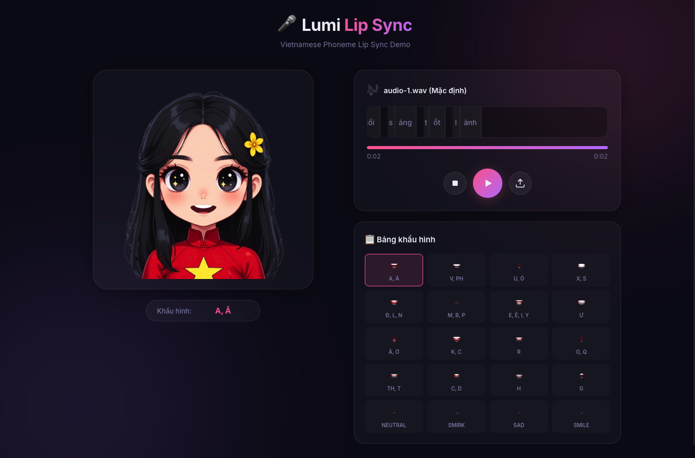

# 🎤 Lumi Lip Sync Demo

Vietnamese Phoneme Lip Sync Demo — Nhép môi tự động cho nhân vật Chibi dựa trên file Audio và JSON alignment.



## ✨ Tính năng

- **20 khẩu hình** ánh xạ đầy đủ phụ âm/nguyên âm Tiếng Việt
- **JSON Alignment** — Đồng bộ miệng chính xác theo timestamp
- **Smart Rescaling** — Tự động co giãn timeline JSON cho khớp audio duration
- **Syllable Sub-phases** — Phụ âm đầu → Nguyên âm → Đóng, chuyển động tự nhiên
- **Drag & Drop** — Kéo thả Audio + JSON, hoặc thả JSON lúc đang phát để cập nhật
- **Timeline trực quan** — Hiển thị token real-time với cuộn tự động
- **Glassmorphism UI** — Giao diện tối hiện đại với hiệu ứng blur

## 🚀 Chạy local

```bash
npm install
npm run dev
```

Mở trình duyệt tại `http://localhost:5173`

## 📁 Cấu trúc file

```
├── index.html              # Trang chính
├── src/
│   ├── main.js             # Logic lip sync, animation, file handling
│   └── style.css           # Glassmorphism dark theme
├── public/
│   ├── audio-1.wav         # Audio mẫu mặc định
│   ├── alignment_audio-1.json  # JSON alignment mặc định
│   └── assets/             # Ảnh nhân vật & 20 lip shapes
└── assets/                 # Ảnh demo & tài nguyên
```

## 🎵 Định dạng JSON Alignment

```json
[
  { "token": "X", "start": 0.168, "end": 0.187 },
  { "token": "i", "start": 0.187, "end": 0.206 },
  { "token": "n", "start": 0.206, "end": 0.225 }
]
```

Mỗi token là một ký tự với timestamp `start` và `end` (đơn vị giây).

## 🔧 Cách hoạt động

1. **Load** — Audio + JSON được tải (mặc định hoặc drag & drop)
2. **Rescale** — Timestamps JSON được co giãn cho khớp audio duration
3. **Smooth** — Token chia theo âm tiết, mỗi âm tiết tạo sub-phases (phụ âm → nguyên âm)
4. **Animate** — `requestAnimationFrame` đồng bộ lip overlay theo thời gian audio real-time

## 📋 Bảng khẩu hình

| # | Ký tự | # | Ký tự |
|---|-------|---|-------|
| 1 | A, Ă | 11 | R |
| 2 | V, PH | 12 | O, Q |
| 3 | U, Ô | 13 | SMIRK |
| 4 | X, S | 14 | SAD |
| 5 | Đ, L, N | 15 | TH, T |
| 6 | M, B, P | 16 | C, D |
| 7 | E, Ê, I, Y | 17 | NEUTRAL |
| 8 | Ư | 18 | SMILE |
| 9 | Â, Ơ | 19 | H |
| 10 | K, C | 20 | G |

## 📄 License

MIT
